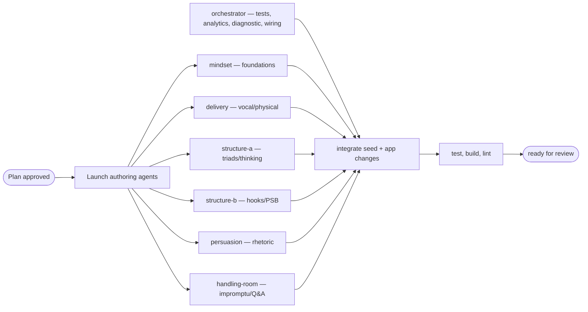

# SpeakFlow Best-in-Class Communication & Public Speaking Upgrade

> Design / implementation plan. Tracks planned changes and progress, per `AGENTS.md`.
> Related Warp plan artifact: `a45a88dd-c542-431d-9550-9a17cd896447`.

## Goal / Problem Statement
SpeakFlow already has a solid Go/SQLite curriculum API, React Learn/Lesson UI, AI
evaluation/coaching endpoints, and strong executive-speaking content. To become a
best-in-class clear communication and public speaking trainer, it needs broader
curriculum coverage, fixed cross-references, stronger practice analytics, a diagnostic
entry point, and a single source of truth for drills.

## Current State
- Curriculum is served from `backend/data/lessons_seed.json` via `backend/store` and
  rendered by `frontend/src/components/Learn.jsx` and `frontend/src/components/Lesson.jsx`.
- Practice happens in `frontend/src/components/Dashboard.jsx` and
  `frontend/src/components/Drills.jsx`.
- Transcript analytics live in `frontend/src/hooks/useSpeechAnalyzer.js` and currently
  track only hedging and WPM.

### Confirmed issues
- `frontend/src/components/Outliner.jsx` links to missing `lesson-rule-of-three` and
  `lesson-problem-solution-benefit` (dead links → "Lesson not found").
- `frontend/src/components/Drills.jsx` maps `strategic-pausing` to `lesson-vocal-warmups`
  and `rule3` to `lesson-dehedging` (wrong targets).
- Drills are duplicated across `src/exercises.js`, `Drills.jsx`, and lesson bodies.
- `sessionHistory` is persisted in `AppContext` but never populated.
- `Lesson.jsx` opens Drills generically instead of selecting the lesson's `relatedDrill`.

## Research Basis
The curriculum expansion is based on gaps found by comparing SpeakFlow with Toastmasters
Pathways and multiple COMM-101 public speaking curricula. Best-in-class programs
consistently include fundamentals, speech purpose and organization, audience analysis,
vocal variety, body language, feedback/self-evaluation, informative and persuasive
speeches, storytelling, impromptu speaking, Q&A, and capstone presentations.

## Proposed Changes & Architecture

### Curriculum (content — `backend/data/lessons_seed.json`)
Restructure the curriculum into eight modules while preserving existing lesson IDs:
- Add `mod-foundations` — Foundations & Mindset.
- Retitle `mod-vocal-foundations` → Vocal & Physical Delivery.
- Retitle `mod-executive-clarity` → Structure & Clarity.
- Add `mod-persuasion` — Persuasion & Influence.
- Keep `mod-storytelling` — Storytelling & Narrative.
- Add `mod-thinking-on-feet` — Thinking on Your Feet.
- Keep `mod-great-orators` — Great Orators Masterclass.
- Keep `mod-capstone` — Capstone Challenges.

Author twelve new lessons (each with teaching blocks, before/after examples, takeaways,
at least one inline drill, and high-quality resources where appropriate):
- `lesson-speaking-anxiety`
- `lesson-audience-analysis`
- `lesson-body-language`
- `lesson-filler-words`
- `lesson-rule-of-three`
- `lesson-structuring-thinking`
- `lesson-openings-closings`
- `lesson-problem-solution-benefit`
- `lesson-ethos-pathos-logos`
- `lesson-monroe-motivated-sequence`
- `lesson-impromptu-prep`
- `lesson-qa-handling`

### Backend (Go)
- Add `fillerCount` to `EvaluateRequest` in `backend/handlers/evaluate.go`.
- Update the evaluation system prompt to assess clarity, structure, audience-awareness,
  confidence, pacing, hedging, and fillers while keeping the existing response JSON schema.
- Add seed integrity tests (see Verification Plan).

### Frontend (React)
- Fix broken wiring: ensure Outliner template lesson IDs resolve, correct drill→lesson
  mappings, and remove the orphaned `src/exercises.js` once drills are curriculum-driven.
- Consolidate drills so `Drills.jsx` flattens `body.drills` from the curriculum and tags
  each drill with its parent `lessonId`.
- Add `activeDrillId` to `AppContext` so `Lesson.jsx` can open Drills with the relevant
  drill preselected.
- Add `fillerCount` to `useSpeechAnalyzer.js` (conservative list: `um`, `uh`, `er`, `ah`,
  `hmm`, `you know`, `i mean`, and similar discourse fillers). Surface filler metrics in
  `Dashboard.jsx`, store them in session history, and recommend `lesson-filler-words` when
  filler use is high.
- Add a lightweight diagnostic flow: capture a quick self-reported goal plus a 60-second
  baseline recording, analyze WPM/hedging/fillers, recommend a starting lesson path, and
  persist the diagnostic result locally.
- Populate and display progress over time by calling `addSession` after successful
  `/api/evaluate` responses and rendering recent sessions on the Dashboard.

## Verification Plan (Automated and Manual)
Follow TDD (write tests before implementation).
- **Backend**: seed integrity tests for module references, unique lesson positions per
  module, and existence of frontend-linked lessons.
- **Frontend**: tests for filler analytics, curriculum-driven drills, Outliner lesson
  links, Diagnostic rendering/recommendations, and Dashboard session persistence.
- **Commands**: run `go test ./...`, `go build ./...`, `npm run test`, `npm run build`,
  and `npm run lint` before finishing.
- **Manual**: walk the full flow — diagnostic → recommended lesson → inline drill →
  practice + evaluation with filler metrics → session history.

Work on a dedicated branch named `feature/best-in-class-curriculum`. Do not commit unless
explicitly requested; if commits are later requested, use small conventional commits with
`Co-Authored-By: Oz <oz-agent@warp.dev>`.

## Orchestration
**Decision**: Use child agents for parallel lesson authoring because the twelve new
lessons are independent content artifacts, while the orchestrator handles integration,
code, tests, and validation.

**Dependencies and ordering**: Plan approval comes first. After approval, launch the
lesson-authoring agents while the orchestrator works on tests and app structure. Fan in
the completed lesson JSON, integrate it into `backend/data/lessons_seed.json`, implement
engine and wiring changes, then run final validation.

**Launch config**: One local batch. Children return complete JSON lesson objects in their
messages and do not write to the repository.

**Child agents**:
- `mindset` — authors `lesson-speaking-anxiety` and `lesson-audience-analysis`.
- `delivery` — authors `lesson-body-language` and `lesson-filler-words`.
- `structure-a` — authors `lesson-rule-of-three` and `lesson-structuring-thinking`.
- `structure-b` — authors `lesson-openings-closings` and `lesson-problem-solution-benefit`.
- `persuasion` — authors `lesson-ethos-pathos-logos` and `lesson-monroe-motivated-sequence`.
- `handling-room` — authors `lesson-impromptu-prep` and `lesson-qa-handling`.

**Merge strategy**: The orchestrator is the sole integrator. All child output is reviewed,
normalized to the existing seed schema, inserted into one curriculum seed, wired to
frontend practice flows, then validated as a single branch.

## Out of Scope
Authentication, premium gating, server-side user accounts, React Router/deep-link URLs,
pitch/tone/volume DSP analysis, slide design, and active-listening lessons are deferred
unless requested.

## Task List / Progress Tracker
### Setup
- [x] Create branch `feature/best-in-class-curriculum`.

### Curriculum content (parallel authoring)
- [x] `lesson-speaking-anxiety`
- [x] `lesson-audience-analysis`
- [x] `lesson-body-language`
- [x] `lesson-filler-words`
- [x] `lesson-rule-of-three`
- [x] `lesson-structuring-thinking`
- [x] `lesson-openings-closings`
- [x] `lesson-problem-solution-benefit`
- [x] `lesson-ethos-pathos-logos`
- [x] `lesson-monroe-motivated-sequence`
- [x] `lesson-impromptu-prep`
- [x] `lesson-qa-handling`
- [x] Restructure modules + integrate all lessons into `lessons_seed.json`.

### Backend (Go)
- [x] Seed integrity tests (module refs, unique positions, linked-lesson existence).
- [x] Add `fillerCount` to `EvaluateRequest` + update evaluation rubric/prompt.

### Frontend (React)
- [x] Filler-word detection in `useSpeechAnalyzer.js` (+ tests).
- [x] Surface filler metrics + recommendation in `Dashboard.jsx`.
- [x] Curriculum-driven drills in `Drills.jsx`; remove `src/exercises.js`.
- [x] `activeDrillId` in `AppContext`; deep-link from `Lesson.jsx`.
- [x] Fix Outliner template lesson links.
- [x] Diagnostic flow + recommendation (+ tests).
- [x] Populate + display session history on Dashboard.

### Validation
- [x] `go test ./...` and `go build ./...` pass.
- [x] `npm run test`, `npm run build`, `npm run lint` pass.
- [x] Manual full-flow walkthrough.
